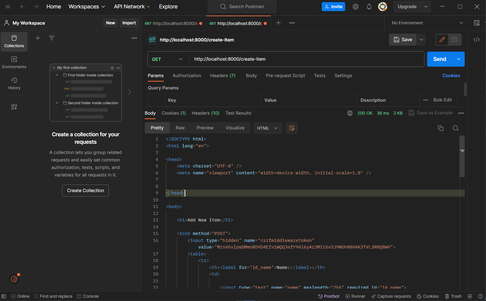
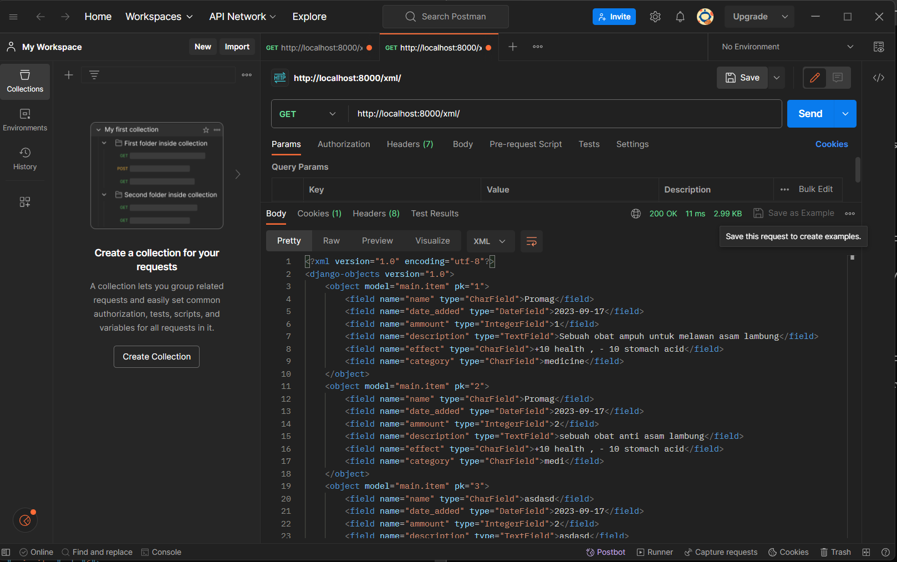
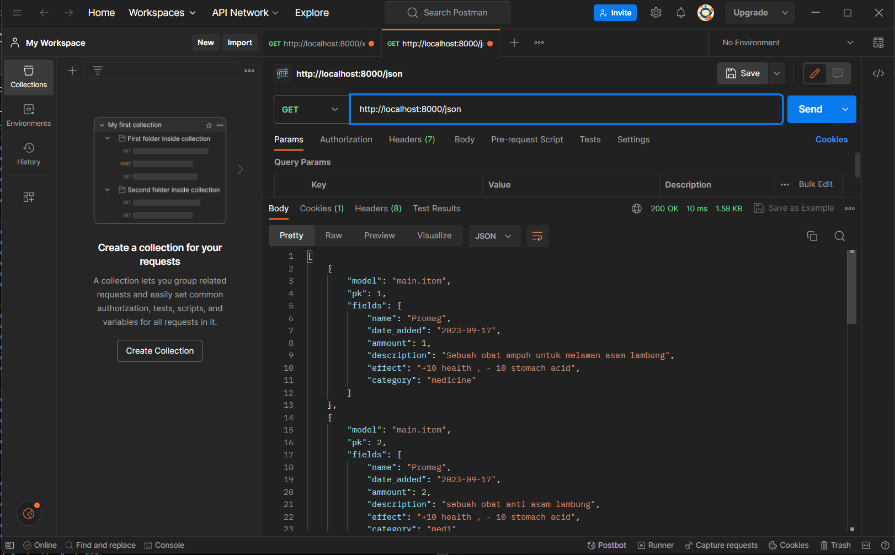
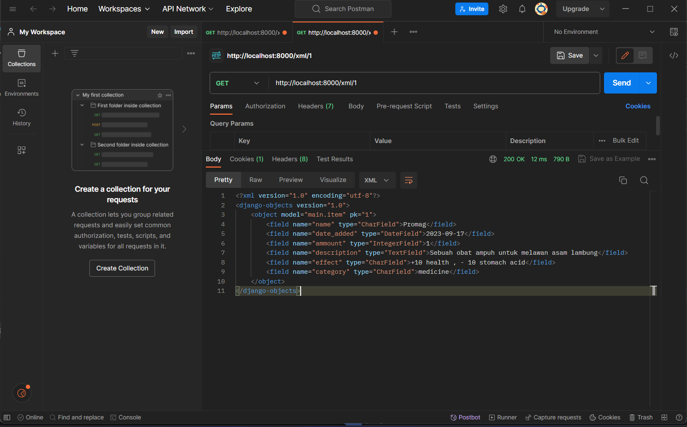
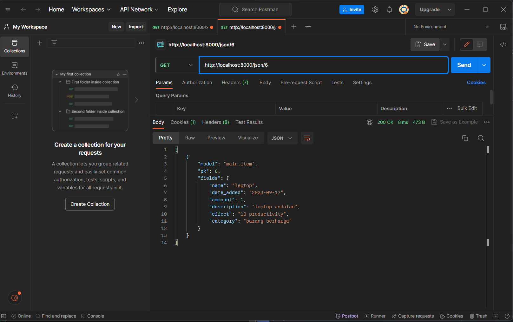

**Nama    : Zaim Aydin Nazif**
**NPM     : 2206082524**
**Kelas   : F**

TUGAS 03:

**Apa perbedaan antara form POST dan form GET dalam Django?**

- GET:
    1. Fungsi : Method ini memiliki fungsi utama untuk mengambil data dari database. Dapat digunakan untuk melakukan pencarian atau mengurutkan data.
    2. Security: Method ini menambahkan data ke URL dalam bentuk parameter query string sehingga keamanan method ini tidak begitu baik bagi data-data yang bersifat sensitif karena data dapat dilihat dari browser history.
    3. Kapasitas data: Memiliki batasan panjang data yang digunakan yakni 2,048 karakter.
    4. Cache: request method GET disimpan dalam cache oleh browser. 

- POST:
    1. Fungsi: Method ini memiliki fungsi utama untuk me-submit data ke database.Biasanya digunakan untuk mengubah data pada server (database) seperti membuat, meng-update, atau menghapus data
    2. Security: data yang dikirim menggunakan method POST dikirim dalam bentuk request body yang menjadikannya lebih aman untuk data yang sensitif
    3. Kapasitas data: tidak memiliki batasan untuk panjang data sehingga cocok digunakan untuk mengirim data dengan kapasitas yang besar.
    4. caching: method POST tidak di-cache oleh browser.

**Apa perbedaan utama antara XML, JSON, dan HTML dalam konteks pengiriman data?**

-XML:
    1. Struktur data: menyimpan data dalam hierarki yang dapat disesuaikan. Terbentuk atas elemen, atribut, dan teks. COcok digunakan untuk mendefinisikan format data yang sesuai kebutuhan.
    2. Penggunaan : digunakan untuk pertukaran data antar aplikasi dalam industri web services, RSS feeds, dll
    3. Sintaks: Bersifat ketat. Menggunakan tag pembuka dan penutup yang harus sejajar. Contohnya: <field name="effect", type="CharField">effect</field>

-JSON: 
    1. Struktur data: data disajikan dalam bentuk pasangan "key-value" seperti dictionary dalam python.
    2. Penggunaan: biasanya digunakan dalam webdevelopment dalam hal pertukaran data anatara server dan device(komputer).
    3. Sintaks: disajikan dalam pasangan "key-value" key digunakan untuk mengakses value yang disimpan. Contoh: "effect" : "+10 health" ("effect" sebagai key dan "+10health" sebagai value).

-HTML:
    1. Struktur data: dapat menyajikan data dan elemennya dalam bentuk tabel, form, dan paragraf.
    2. Penggunaan: fiigunakan untuk membuat halaman web. Menyajikan data kepada pengguna.
    3. Sintaks: menggunakan tag untuk mengelompokkan konten dan menentukan struktur halaman web. Contoh: "<h5>Name:</h5>"

**Mengapa JSON sering digunakan dalam pertukaran data antara aplikasi web modern?**

Alasan:
    1. Mudah dibaca dan ditulis baik bagi manusia maupun mesin.
    2. format pertukaran data yang ringan
    3. data struktur yang mirip dengan JavaScript sehingga banyak digunakan pada aplikasi web yang menggunakan bahasa JavaScript.
    4. JSON efisien dalam hal ukuran dan pemrosesan data. Sintaksnya yang ringkas menghasilkan muatan yang lebih kecil, mengurangi penggunaan bandwidth dan meningkatkan kecepatan transfer data.
    5. JSON didukung oleh hampir semua bahasa pemrograman dan platform. Kompatibilitas dalam banyak bahasa ini menjadikannya pilihan serbaguna untuk bertukar data di antara sistem yang berbeda, apa pun bahasa pemrograman yang mereka gunakan.
    6. JSON dianggap lebih aman daripada format lain, seperti XML, karena tidak memiliki fitur seperti document type definitions (DTD) dan referensi entitas eksternal yang dapat menyebabkan kerentanan keamanan, seperti serangan injeksi XML.

**Jelaskan bagaimana cara kamu mengimplementasikan checklist di atas secara step-by-step**

1. Sebelum saya membuat form input data kerangka (skeleton) agar setiap halaman web yang saya miliki memiliki template yang sama.

    1. saya membuat file "base.html" pada direktori templates. File tersebut nantinya akan menjadi dasar tampilan dari semua halaman web yang saya tampilkan. 
    2. Kemudian, saya menambahkan kode "'DIRS': [BASE_DIR / 'templates']" pada variable "TEMPLATES" yang terletak di berkas "settings.py" agar file "base.html" terdeteksi sebagai berkas template.
    3. Mengubah isi dari "main.html" sebelumnya agar sesuai dengan template baru "base.html"

2. Membuat form input data

    1. membuat berkas "forms.py" pada direktori main untuk membuat struktur form.
    2. membuat class "ItemForm" yang berisikan "class meta".
    3. membuat variable "model" dengan value "Item" untuk agar data yang diambil dari form nantinya akan disimpan sebagai objek dari "Item"
    4. membuat variable fields yang berisikan field dari model Item yang digunakan yakni "name", "ammount", "description", "effect", "category"
    

3.   Tambahkan 5 fungsi views untuk melihat objek yang sudah ditambahkan dalam format HTML, XML, JSON, XML by ID, dan JSON by ID.

    -HTML:
    1. menambahkan import pada "views.py".:
        1. "from django.http import HttpResponseRedirect" 
        2. "from main.forms import ProductForm" 
        3. "from django.urls import reverse"
        4. "from .models import Item" 
    2. membuat fungsi bernama "create_item" pada berkas views.py yang menerima parameter request. membuat variable "form" yang berisikan "form = ItemForm(request.POST or None)" yang digunakan untuk membuat ItemForm baru dengan cara memasukkan QuerryDict berdasarkan input user. Mengecek kevalidan input untuk form dengan menggunakan "form.is_valid()" kemudian menyimpan form bila data yang diinput valid dengan "form.save()". Mengembalikan ke fungsi "show_main" dengan " return HttpResponseRedirect(reverse('main:show_main'))" apabila form berhasil disimpan.
    3. Membuat berkas html baru "create_item.html" pada direktori templates untuk menampilkan halaman "Add Item".
    4. Menambahkan variabel "items = Item.objects.all()" pada berkas "views.py" yang berfungsi untuk mengambil seluruh object Item yang tersimpan dalam database. Kemudian menambahkan " 'items' : items " pada context untuk menampilkan data terkait items yang ada dalam inventory.
    5. Membuat table yang berisikan fields data dari objects yang ada pada database.
    6. Menampilkan seluruh data dari objects Item yang ada di database beserta data fieldsnya dengan menggunakan loop ""
    7. Membuat button untuk membuat item agar ketika ditekan dapat berpindah ke halaman create_item.

    -XML:
    1. Menambahkan import pada berkas "views.py" berupa:
        - from django.http import HttpResponse
        - from django.core import serializers
    2. Membuat fungsi "show_xml(request)"
    3. Membuat variabel "data = Item.objects.all()" pada fungsi yang telah dibuat untuk mendapatkan seluruh object Item yang ada dalam database.
    4. Membuat return fungsi "return HttpResponse(serializers.serialize("xml", data), content_type="application/xml")". Serializers berfungsi sebagai penerjemah objek Item menjadi format XML.

    -JSON:
    1. Membuat fungsi "show_json(request)" pada berkas "views.py"
    2. Membuat variabel "data = Item.objects.all()" pada fungsi yang telah dibuat untuk mendapatkan seluruh object Item yang ada dalam database.
    3.Membuat return fungsi " return HttpResponse(serializers.serialize("json", data), content_type="application/json") ". Serializers berfungsi sebagai penerjemah objek Item menjadi format JSON.
    
    -XML by ID:
    1. Membuat fungsi "show_xml_by_id(request,id)" pada berkas "views.py"
    2. Membuat variable "data = Item.objects.filter(pk=id)" untuk mendapatkan object Item dengan id yang dimasukkan.
    3. Menambahkan return fungsi "return HttpResponse(serializers.serialize("xml", data), content_type="application/xml")"

    -JSON by ID:
    1. Membuat fungsi "show_xml_by_id(request,id)" pada berkas "views.py"
    2. Membuat variable "data = Item.objects.filter(pk=id)" untuk mendapatkan object Item dengan id yang dimasukkan.
    3. Menambahkan return fungsi " return HttpResponse(serializers.serialize("json", data), content_type="application/json") "
    
3. Membuat routing URL untuk masing-masing views yang telah ditambahkan pada poin 2.

    HTML:
    1. Mengimport fungsi "create_Item" yang telah dibuat pada "urls.py" yang ada dalam folder main.
    2. Menambahkan path yakni "path('create-item', create_item, name='create_item')," agar ketika button "Add Item" yang berada dalam halaman utama ditekan dapat berpindah ke halaman untuk menambahkan item baru.
    3. menambahkan return " return HttpResponseRedirect(reverse('main:show_main'))" pada fungsi "create_item" yang ada di dalam file views.py agar dapat kembali ke halaman utama tempat semua data ditampilkan setelah menekan tombol "Add Item"

    XML :
    1. Mengimport fungsi "show_xml" yang telah dibuat pada "urls.py" yang ada dalam folder main.
    2. Menambahkan path yakni "path('xml/', show_xml, name='show_xml'), " agar data yang telah disimpan dapat dilihat di "http://localhost:8000/xml " dalam format xml.

    JSON:
    1. Mengimport fungsi "show_json" yang telah dibuat pada "urls.py" yang ada dalam folder main.
    2. Menambahkan path yakni "path('xml/', show_json, name='show_json'), " agar data yang telah disimpan dapat dilihat di "http://localhost:8000/json " dalam format json.

    XML by ID:
    1. Mengimport fungsi "show_xml_by_id" yang telah dibuat pada "urls.py" yang ada dalam folder main.
    2. Menambahkan path yakni "path('xml/<int:id>/', show_xml_by_id, name='show_xml_by_id')," agar data sesuai id yang diberikan dan telah disimpan dapat dilihat di "http://localhost:8000/xml/[id]" dalam format xml.

    JSON by ID:
    1. Mengimport fungsi "show_json_by_id" yang telah dibuat pada "urls.py" yang ada dalam folder main.
    2. Menambahkan path yakni "path('json/<int:id>/', show_json_by_id, name='show_json_by_id')," agar data sesuai id dan telah disimpan dapat dilihat di "http://localhost:8000/json/[id]" dalam format json.

**Mengakses kelima URL di poin 2 menggunakan Postman, membuat screenshot dari hasil akses URL pada Postman, dan menambahkannya ke dalam README.md.**

HTML: 

XML:

JSON:

XML by ID:

JSON by ID:

